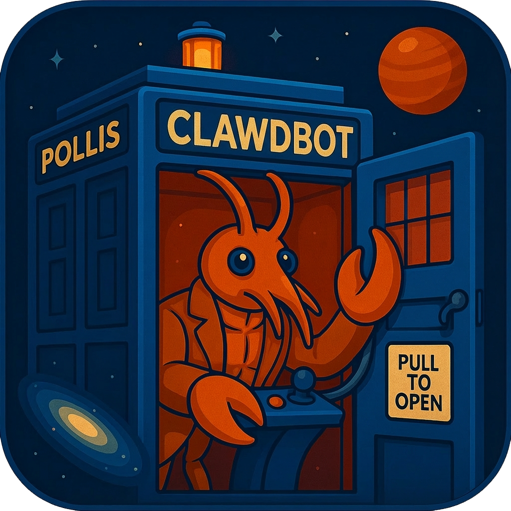

<p align="center">
  
</p>

<h1 align="center">⚕ Hermes Desktop</h1>

<p align="center">
  <strong>One Click Install, One Hermes Agent.</strong><br/>
  一键安装，即刻开聊。零配置、零依赖的 <a href="https://github.com/NousResearch/hermes-agent">Hermes Agent</a> 桌面客户端。
</p>

<p align="center">
  <a href="https://github.com/advanceyue/hermes-desktop/releases/latest"></a>
  <a href="https://github.com/advanceyue/hermes-desktop/releases"></a>
  <a href="https://github.com/advanceyue/hermes-desktop/blob/main/LICENSE"></a>
</p>

---

## 🇨🇳 中文

### ✨ 为什么选 Hermes Desktop？

> **不装 Python，不跑 `pip install`，不配环境变量。**
> 双击安装包 → 输入 API Key → 开始对话。就这么简单。

Hermes Desktop 把 [Hermes Agent](https://github.com/NousResearch/hermes-agent)（Nous Research 出品的开源 AI Agent）打包成一个**开箱即用**的桌面应用。内置 Python 3.11 运行时、Node.js 22、ripgrep 和完整的 Hermes 生态，你不需要任何开发工具链。

它的目标很简单：**让 AI 真正替你动手做事，而不是只会聊天。** 🎯

| 🚀 特性 | 说明 |
|---|---|
| ⚡ **一键安装** | 下载 DMG → 拖入 Applications → 输入 Key → 开聊 |
| 🖥️ **跨平台** | macOS (Apple Silicon / Intel)，Windows 支持开发中 |
| 🔒 **密钥本地存储** | API Key 只存在你的电脑上，绝不上传任何服务器 |
| 🤖 **多模型支持** | Anthropic / OpenAI / Google / OpenRouter / DeepSeek，随时切换 |
| 🔄 **自动更新** | 内置更新机制，新版本自动提示 |
| 🧠 **40+ 工具** | 终端执行、文件操作、浏览器自动化、代码执行、图片生成… |
| 📚 **159 技能** | 内置技能库覆盖开发、研究、创意、生产力等场景 |
| 💬 **多平台网关** | Telegram / Discord / Slack / WhatsApp / 飞书 / 微信 |
| 📎 **文件拖拽** | 拖入文件或粘贴图片，直接在对话中使用 |
| 🖋️ **终端命令** | 自动安装 `hermes` 命令到 PATH，终端也能用 |
| ⏰ **定时任务** | 支持 Cron 定时执行任务，结果推送到聊天平台 |
| 🧩 **技能编辑** | 创建、编辑、管理可复用的 Agent 技能 |

### 📦 下载安装

前往 [Releases 页面](https://github.com/advanceyue/hermes-desktop/releases/latest) 下载对应平台的安装包：

| 平台 | 架构 | 下载 |
|---|---|---|
| 🍎 macOS | Apple Silicon (M1/M2/M3/M4) | `HermesDesktop-x.x.x-arm64.dmg` |
| 🍎 macOS | Intel | `HermesDesktop-x.x.x-x64.dmg` |
| 🪟 Windows | x64 | `HermesDesktop-Setup-x.x.x-x64.exe`（开发中） |

> 💡 **快速判断**：苹果 M 系列选 arm64，Intel Mac 选 x64。

### 🚀 三步上手

```
1️⃣  双击 DMG，拖入 Applications
2️⃣  选择 AI 服务商，输入 API Key
3️⃣  开始对话！ 🎉
```

就这样。不需要装 Python，不需要 `pip`，不需要 `git clone`，不需要配置任何环境变量。

### 🤖 支持的 AI 提供商

| 提供商 | 默认模型 | 获取 Key |
|---|---|---|
| Anthropic | Claude Sonnet 4 | [console.anthropic.com](https://console.anthropic.com/) |
| OpenAI | GPT-4o | [platform.openai.com](https://platform.openai.com/) |
| Google | Gemini 2.5 Pro | [aistudio.google.com](https://aistudio.google.com/) |
| OpenRouter | 多模型 | [openrouter.ai](https://openrouter.ai/) |
| DeepSeek | DeepSeek Chat | [platform.deepseek.com](https://platform.deepseek.com/) |

### 💡 典型使用场景

- 🗂️ "帮我抓取某网站的数据，整理成 Excel"
- 📊 "分析这份代码仓库，给出架构建议"
- 📝 "把这篇文章翻译成英文，保持排版"
- 🔍 "搜索最近的 AI 论文，写一份摘要"
- 🖥️ "在终端执行这组命令，监控输出"
- 🎨 "生成一张产品海报"

你负责提需求，Hermes 负责执行。

### 🏗️ 架构

```
Hermes Desktop (Electron)
  ├── 🐍 WebUI 子进程     (Python 3.11 → hermes-webui on :8787)
  ├── 💬 主窗口           (加载 http://localhost:8787)
  ├── 📦 内置资源
  │   ├── python/         (standalone Python 3.11, ~60MB)
  │   ├── venv/           (hermes-agent + 全部依赖)
  │   ├── runtime/        (Node.js 22, 用于浏览器自动化)
  │   ├── tools/          (ripgrep 快速搜索)
  │   └── webui/          (hermes-webui 聊天界面)
  └── 📁 用户数据 → ~/.hermes/
```

### ❓ 常见问题

**Q: 我完全不会编程，可以用吗？**
A: 当然可以！Hermes Desktop 就是为非技术用户设计的 😊

**Q: 需要自己安装 Python 或 Node.js 吗？**
A: 不需要。应用已内置所有运行环境。

**Q: 跟命令行版的 Hermes Agent 有什么区别？**
A: 功能完全一样，共享同一份配置文件（`~/.hermes/`）。桌面版多了图形界面、系统托盘和自动更新。

**Q: 数据存在哪里？**
A: 所有数据都在你本机的 `~/.hermes/` 目录，包括配置、API Key、聊天记录和记忆。

**Q: 支持 OpenAI Codex OAuth 吗？**
A: 目前 Setup 向导支持 API Key 方式。Codex OAuth 可以通过命令行 `hermes auth add openai-codex` 配置。

---

## 🇬🇧 English

### ✨ Why Hermes Desktop?

> **No Python. No `pip install`. No environment variables.**
> Download → double-click → enter API Key → start chatting. That's it.

Hermes Desktop wraps [Hermes Agent](https://github.com/NousResearch/hermes-agent) (an open-source AI Agent by Nous Research) into a **ready-to-use** desktop app. It bundles Python 3.11, Node.js 22, ripgrep, and the complete Hermes ecosystem — zero dev tooling required.

Its goal is simple: **AI that gets things done, not just chats.** 🎯

| 🚀 Feature | Description |
|---|---|
| ⚡ **One-Click Install** | Download DMG → drag to Applications → enter Key → chat |
| 🖥️ **Cross-Platform** | macOS (Apple Silicon / Intel), Windows in development |
| 🔒 **Keys Stay Local** | API keys are stored on your machine, never uploaded anywhere |
| 🤖 **Multi-Model** | Anthropic / OpenAI / Google / OpenRouter / DeepSeek |
| 🔄 **Auto-Update** | Built-in update mechanism with automatic notifications |
| 🧠 **40+ Tools** | Terminal, file ops, browser automation, code execution, image gen… |
| 📚 **159 Skills** | Built-in skill library for dev, research, creative, productivity |
| 💬 **Multi-Platform Gateway** | Telegram / Discord / Slack / WhatsApp / Feishu / WeChat |
| 📎 **File Attachments** | Drag-and-drop files or paste images directly into chat |
| 🖋️ **Terminal Command** | Auto-installs `hermes` CLI to PATH |
| ⏰ **Scheduled Tasks** | Cron-based task scheduling with chat platform delivery |
| 🧩 **Skill Editor** | Create, edit, and manage reusable Agent skills |

### 📦 Download

Head to the [Releases page](https://github.com/advanceyue/hermes-desktop/releases/latest) and grab the installer:

| Platform | Architecture | File |
|---|---|---|
| 🍎 macOS | Apple Silicon (M1/M2/M3/M4) | `HermesDesktop-x.x.x-arm64.dmg` |
| 🍎 macOS | Intel | `HermesDesktop-x.x.x-x64.dmg` |
| 🪟 Windows | x64 | `HermesDesktop-Setup-x.x.x-x64.exe` (WIP) |

> 💡 Apple M-series → arm64, Intel Mac → x64.

### 🚀 Get Started in 3 Steps

```
1️⃣  Install — drag to Applications
2️⃣  Configure — pick a provider, enter your API Key
3️⃣  Chat! 🎉
```

No Python, no `pip`, no `git clone`, no environment setup. Just works.

### 🤖 Supported AI Providers

| Provider | Default Model | Get Key |
|---|---|---|
| Anthropic | Claude Sonnet 4 | [console.anthropic.com](https://console.anthropic.com/) |
| OpenAI | GPT-4o | [platform.openai.com](https://platform.openai.com/) |
| Google | Gemini 2.5 Pro | [aistudio.google.com](https://aistudio.google.com/) |
| OpenRouter | Multi-model | [openrouter.ai](https://openrouter.ai/) |
| DeepSeek | DeepSeek Chat | [platform.deepseek.com](https://platform.deepseek.com/) |

### 💡 Typical Use Cases

- 🗂️ "Scrape data from this website and export to Excel"
- 📊 "Analyze this codebase and suggest architecture improvements"
- 📝 "Translate this article to English, preserve formatting"
- 🔍 "Search recent AI papers and write a summary"
- 🖥️ "Run these terminal commands and monitor output"
- 🎨 "Generate a product poster"

You define the goal, Hermes executes.

### 🏗️ Architecture

```
Hermes Desktop (Electron)
  ├── 🐍 WebUI subprocess   (Python 3.11 → hermes-webui on :8787)
  ├── 💬 Main window         (loads http://localhost:8787)
  ├── 📦 Bundled Resources
  │   ├── python/            (standalone Python 3.11, ~60MB)
  │   ├── venv/              (hermes-agent + all dependencies)
  │   ├── runtime/           (Node.js 22 for browser automation)
  │   ├── tools/             (ripgrep for fast search)
  │   └── webui/             (hermes-webui chat interface)
  └── 📁 User data → ~/.hermes/
```

### ❓ FAQ

**Q: Can I use this if I don't code at all?**
A: Absolutely! Hermes Desktop is designed for everyone 😊

**Q: Do I need to install Python or Node.js?**
A: No. The app includes everything it needs.

**Q: What's the difference from CLI Hermes Agent?**
A: Same features, shared config (`~/.hermes/`). Desktop adds a GUI, system tray, and auto-updates.

**Q: Where is my data stored?**
A: Everything stays on your machine in `~/.hermes/` — config, API keys, chat history, and memories.

---

## 🛠️ Building from Source

### Prerequisites

- Node.js >= 22
- Git

### macOS (arm64)

```bash
# 1. Clone this repo
git clone https://github.com/advanceyue/hermes-desktop.git
cd hermes-desktop

# 2. Clone dependencies (hermes-agent + hermes-webui)
git clone https://github.com/NousResearch/hermes-agent.git ~/.hermes/hermes-agent
git clone https://github.com/nesquena/hermes-webui.git ~/code/hermes-webui

# 3. Install Node.js dependencies
npm install

# 4. Package resources (auto-downloads Python 3.11, Node.js 22, ripgrep)
npm run package:resources -- --platform darwin --arch arm64

# 5. Build DMG
npm run build
npm run dist:mac:arm64
```

Output: `out/darwin-arm64/HermesDesktop-{version}-arm64.dmg`

### macOS (Intel x64)

```bash
npm run package:resources -- --platform darwin --arch x64
npm run build
npm run dist:mac:x64
```

### Windows (x64)

```bash
# Must run on Windows (Python venv is platform-specific)
git clone https://github.com/NousResearch/hermes-agent.git %USERPROFILE%\.hermes\hermes-agent
git clone https://github.com/nesquena/hermes-webui.git %USERPROFILE%\code\hermes-webui

npm install
npm run package:resources -- --platform win32 --arch x64
npm run build
npm run dist:win:x64
```

### Custom Source Paths

If hermes-agent or hermes-webui are in non-default locations:

```bash
HERMES_AGENT_DIR=/path/to/hermes-agent \
HERMES_WEBUI_DIR=/path/to/hermes-webui \
npm run package:resources -- --platform darwin --arch arm64
```

---

## ⭐ 觉得有用？给个 Star 吧

如果 Hermes Desktop 帮到了你，请给个 ⭐ Star 支持一下！

[](https://star-history.com/#advanceyue/hermes-desktop&Date)

## 🙏 Credits

- [Hermes Agent](https://github.com/NousResearch/hermes-agent) by Nous Research
- [hermes-webui](https://github.com/nesquena/hermes-webui) by nesquena
- Built with [Electron](https://www.electronjs.org/) and [electron-builder](https://www.electron.build/)

## 📄 License

MIT
