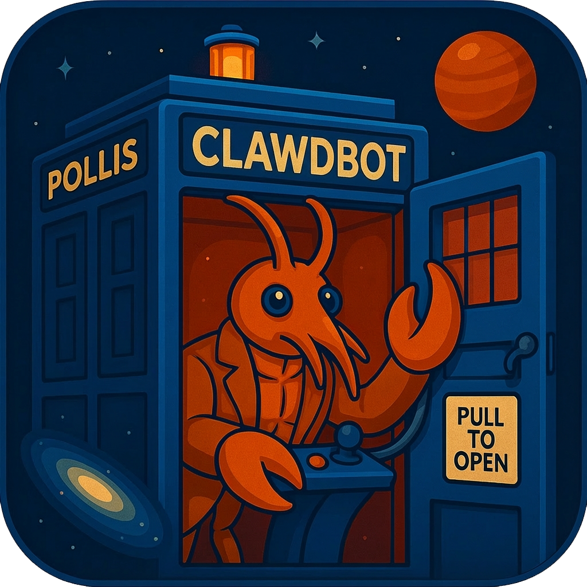

<p align="center">
  
</p>

<h1 align="center">Hermes Desktop — Linux ARM64</h1>

<p align="center">
  <strong>Hermes Agent on Linux aarch64. No cloud required.</strong>
</p>

<p align="center">
  
  
  
  
  <a href="LICENSE"></a>
</p>

---

This is the Linux ARM64 build of [Hermes Desktop](https://github.com/advanceyue/hermes-desktop) — an Electron wrapper around [Hermes Agent](https://github.com/NousResearch/hermes-agent) by Nous Research. The upstream project ships macOS and Windows only. This build brings it to aarch64 Linux, with everything needed to run fully local on ARM hardware.

Tested and first built on an **NVIDIA Jetson AGX Orin** running Ubuntu 22.04 (JetPack 6.2). Paired with Ollama and a local model, it runs entirely offline — no API keys, no cloud, no data leaving the machine.

---

## Hardware

| Device | Status |
|---|---|
| NVIDIA Jetson AGX Orin | ✅ Verified |
| NVIDIA Jetson Orin NX / Nano | 🔲 Should work |
| Raspberry Pi 4 / 5 (64-bit OS) | 🔲 Should work |
| Any aarch64 Linux system | 🔲 Should work |

---

## What's inside

Hermes Desktop bundles everything. No Python, no Node.js, no pip — just the AppImage.

```
HermesDesktop.AppImage
  ├── Electron 40          (the shell)
  ├── Python 3.11          (standalone, ~60MB)
  ├── venv                 (hermes-agent + all dependencies)
  ├── Node.js 22           (for browser automation tools)
  ├── ripgrep              (fast file search)
  └── hermes-webui         (the chat interface, served on :8787)
```

All user data lives in `~/.hermes/` — shared with the CLI if you use it.

---

## Build

> There are no pre-built binaries here yet. Build takes ~5 minutes.

### Requirements

- aarch64 Linux (Ubuntu 22.04+ recommended)
- Node.js 22+ — install via [nvm](https://github.com/nvm-sh/nvm):
  ```bash
  curl -o- https://raw.githubusercontent.com/nvm-sh/nvm/v0.40.0/install.sh | bash
  source ~/.nvm/nvm.sh && nvm install 22
  ```
- Git

### Steps

```bash
# 1. Clone this repo
git clone https://github.com/fdfretes/hermes-desktop.git
cd hermes-desktop

# 2. Clone the agent and webui
git clone https://github.com/NousResearch/hermes-agent.git ~/.hermes/hermes-agent
git clone https://github.com/nesquena/hermes-webui.git ~/code/hermes-webui

# 3. Install dependencies
npm install

# 4. Build
npm run dist:linux:arm64
```

Output: `out/linux-arm64/HermesDesktop-{version}-arm64.AppImage`

---

## Run

```bash
chmod +x out/linux-arm64/HermesDesktop-*.AppImage
./out/linux-arm64/HermesDesktop-*.AppImage --no-sandbox
```

`--no-sandbox` is required on most ARM64 Linux kernels (Jetson, RPi, etc.) that don't expose user namespaces to unprivileged processes.

### Desktop shortcut (optional)

```bash
mkdir -p ~/.local/share/applications
cat > ~/.local/share/applications/hermes-desktop.desktop <<EOF
[Desktop Entry]
Name=Hermes Desktop
Exec=/path/to/HermesDesktop-arm64.AppImage --no-sandbox
Icon=/path/to/hermes-desktop/assets/icon.png
Type=Application
Categories=Utility;
EOF
update-desktop-database ~/.local/share/applications/
```

---

## Running fully local with Ollama

Hermes works out of the box with any OpenAI-compatible API. On ARM64 hardware, Ollama is the natural choice.

```bash
# Install Ollama
curl -fsSL https://ollama.com/install.sh | sh

# Pull a model (adjust to your RAM)
ollama pull qwen3-coder:30b      # ~20GB — good for 32GB+ systems
ollama pull qwen3-coder:8b       # ~5GB  — works on Raspberry Pi
```

Then in Hermes Desktop Setup, or directly in `~/.hermes/config.yaml`:

```yaml
provider: custom
model: qwen3-coder:30b
base_url: http://localhost:11434/v1
api_key: ollama
context_length: 65536
```

> **Tip:** Ollama's default context window is very small. Set `num_ctx` in your Modelfile or use a model variant with a larger context — agent tool-loops depend on it.

---

## What was changed from upstream

The upstream project supports macOS and Windows. Four files were modified to add Linux:

**`scripts/package-resources.js`**
Added `linux-arm64` and `linux-x64` entries to the three platform/arch maps that resolve download URLs for Python standalone, Node.js, and ripgrep.

**`electron-builder.yml`**
Added a `linux` target producing an AppImage.

**`package.json`**
Added `dist:linux:arm64` script.

**`scripts/afterPack.js`** *(bug fix)*
`copyDirSync` didn't handle symlinks pointing to directories. Linux Python venvs create `lib64 → lib` as a directory symlink; the original code called `copyFileSync` on it and threw `EISDIR`. This fix applies to all Linux builds, not just ARM64.

---

## Supported AI providers

Works with any OpenAI-compatible API, plus native integrations:

| Provider | Notes |
|---|---|
| Ollama | Local, no key needed — recommended for ARM64 |
| Anthropic | Claude models via API key |
| OpenAI | GPT models via API key |
| Google | Gemini via API key |
| OpenRouter | Access to many models via one key |
| DeepSeek | Via API key |
| Custom | Any OpenAI-compatible endpoint |

---

## Credits

[Hermes Agent](https://github.com/NousResearch/hermes-agent) by Nous Research —
[hermes-webui](https://github.com/nesquena/hermes-webui) by nesquena —
[Hermes Desktop](https://github.com/advanceyue/hermes-desktop) by advanceyue
